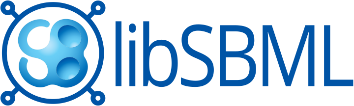

libSBML
=============================================================================

LibSBML is an open-source library for working with SBML (the Systems Biology Markup Language).  It is written in C++ and provides language bindings for many other programming languages.

[?label=Nightly%20build&style=flat-square)](https://github.com/sbmlteam/libsbml/actions/workflows/store-artefact.yml)

Table of contents
-----------------

* [Introduction](#introduction)
* [Installation](#installation)
* [Usage](#usage)
* [Relationships to other similar tools](#relationships-to-other-similar-tools)
* [Getting help](#getting-help)
* [Contributing](#contributing)
* [License](#license)
* [Authors and history](#authors-and-history)
* [Acknowledgments](#acknowledgments)

Introduction
------------

LibSBML is a programming library that helps you read, write, manipulate, translate, and validate files and data streams in the [SBML (Systems Biology Markup Language)](http://sbml.org) format.  Developers can embed the library in their applications, saving themselves the work of implementing their own parsing, manipulation and validation software. At the API level, libSBML provides the same interface to data structures independently of whether the model originated in SBML Level&nbsp;1, 2 or&nbsp;3.  LibSBML understands all Levels and Versions of SBML, and supports all **SBML Level&nbsp;3 packages**.

Why not simply use a generic XML parsing library?  A specialized library such as libSBML or [JSBML](https://github.com/sbmlteam/jsbml) offers many advantages over using a generic XML library directly.  Here are some:

* **Domain-specific object model**.  LibSBML's object model and API are designed around SBML and the operations that are commonly needed when working with SBML.

* **Validation facilities**. LibSBML implements all the validation rules defined in the SBML specifications, and performs additional validation of its own.  (These validation rules are not part of the SBML schemas.)

* **Conversion facilities**: LibSBML can convert between most Levels and Versions of SBML, and can interconvert between certain kinds of SBML constructs.

* **Broad language support**: LibSBML is written in ISO standard C++ and provides APIs for the languages C, C++, C#, Java, JavaScript, MATLAB, Perl, PHP, Python, R, and Ruby.

* **Other features**. LibSBML offers powerful features such as reading/writing compressed SBML files, detecting overconstrained models, dimensional analysis and unit checking, and an API for SBML `<annotation>` content.

LibSBML works on Linux, Windows, MacOS X, and other operating systems, and can use any of the three most popular XML parser libraries: [Xerces](http://xml.apache.org/xerces-c), [Expat](http://expat.sourceforge.net/), and [libxml2](http://xmlsoft.org/).

Installation
------------

A **stable release** of libSBML includes support for SBML Level&nbsp;3 Core and all accepted SBML &nbsp;3 packages, as well as support for packages that are currently under development. An **experimental-only release** only updates code for the SBML Level&nbsp;3 packages under development.

Before the year 2020, we used SourceForge for our code repository and software downloads.  Though you can find the source code releases on GitHub, our **binary** software releases for libSBML are currently still done from SourceForge at the following location:

<b>
↓ ↓ ↓ 
→ → →&nbsp;&nbsp;&nbsp;&nbsp; http://sourceforge.net/projects/sbml/files/libsbml/ &nbsp;&nbsp;&nbsp;&nbsp;← ← ← 
↑ ↑ ↑
</b>

We provide Zenodo DOIs for specific releases, so that you can cite the exact version of the software that you use:

* libSBML-5.19.0 &rArr; [10.5281/zenodo.4293358](https://doi.org/10.5281/zenodo.4293358)
* libSBML-5.18.0 &rArr; [10.5281/zenodo.2645216](https://doi.org/10.5281/zenodo.2645216)
* libSBML-5.17.0 &rArr; [10.5281/zenodo.1250696](https://doi.org/10.5281/zenodo.1250696)
* libSBML-5.16.0 &rArr; [10.5281/zenodo.1095483](https://doi.org/10.5281/zenodo.1095483)
* libSBML-5.15.0 &rArr; [10.5281/zenodo.495344](https://doi.org/10.5281/zenodo.495344)

If you'd like to include the latest features, binaries of the latest `development` branch of `SBMLTeam/libsbml` are [built nightly](artefacts.md) by the CI/CD system.
Further information for developers about the CI/CD system can be found [here](ci.md).

Usage
-----

Please read the file [NEWS.txt]() for highlights about recent changes in libSBML and important information.

Documentation is available online at http://sbml.org/software/libsbml

Getting help
------------

We encourage you to join the [sbml-discuss](https://groups.google.com/g/sbml-discuss) group, where other libSBML users can be found.  You can ask questions and discuss the development, use, and interoperability of all kinds of software that supports SBML.

You can report issues, suggestions and requests using the [GitHub issue tracker](https://github.com/sbmlteam/libsbml/issues).  If you are interested in participating in or observing libSBML development more closely, we encourage you to join [libsbml-development@googlegroups.com](https://groups.google.com/forum/#!forum/libsbml-development), a mailing list and web forum devoted to discussions about LIBSBML.

You can email the main developers directly at [libsbml-team@googlegroups.com](mailto:libsbml-team@googlegroups.com).

Contributing
------------

We welcome contributions to libSBML!  Please read our [contribution guidelines](CONTRIBUTING.md), and also feel free to contact the developers at [libsbml-team@googlegroups.com](mailto:libsbml-team@googlegroups.com) to coordinate your efforts.

License
-------

LibSBML is available for free under the terms of the [LGPL version 2.1](https://www.gnu.org/licenses/old-licenses/lgpl-2.1.en.html) in both source-code form and precompiled binaries for a variety of systems.  Please see the accompanying license file, [LICENSE.html](LICENSE.html), for detailed copyright and license information, particularly for **third-party software included in and used by the libSBML distribution**.

Authors and history
---------------------------

LibSBML's main authors are [Sarah M. Keating](https://github.com/skeating), [Frank T. Bergmann](https://www.cos.uni-heidelberg.de/index.php/f.bergmann/?l=_e), [Lucian P. Smith](https://github.com/luciansmith), [Brett G. Olivier](http://www.bgoli.net), [Akiya Jouraku](https://www.researchgate.net/profile/Akiya_Jouraku), [Michael Hucka](http://www.cds.caltech.edu/~mhucka/), and [Ben Bornstein](http://ml.jpl.nasa.gov/people/bornstein.shtml), with contributions from many others.  We especially thank the following (in alphabetical order):

* Gordon Ball
* Bill Denney
* Alessandro Felder
* Christoph Flamm
* Akira Funahashi
* Ralph Gauges
* Martin Ginkel
* Alex Gutteridge
* Stefan Hoops
* Totte Karlsson
* Moriyoshi Koizumi
* Ben Kovitz
* Rainer Machn&eacute;
* Thomas Pfau
* Nicolas Rodriguez
* Jamie J Quinn
* Fengkai Zhang

Research notice
---------------
Please note that this repository is participating in a study into sustainability
 of open source projects. Data will be gathered about this repository for
 approximately the next 12 months, starting from July 2021.

Data collected will include number of contributors, number of PRs, time taken to
 close/merge these PRs, and issues closed.

For more information, please visit
[this informational page](https://sustainable-open-science-and-software.github.io/) or download the [participant information sheet](https://sustainable-open-science-and-software.github.io/assets/PIS_sustainable_software.pdf).

Acknowledgments
---------------

The development of libSBML was supported in largely by funding from the [National Institute of General Medical Sciences](https://www.nigms.nih.gov) (USA) under grant R01&nbsp;GM070923 (principal investigator: Michael Hucka).

The work to facilitate moving libSBML to GitHub and establishing Continuous Integration Testing was funded by [Chan Zuckerberg Initiative](https://chanzuckerberg.com/) under grant 2020-218578 (5022) (principal investigator: Sarah M Keating).

Contributions to libSBML have also come as a result of work by the SBML Team and others on other grant-funded projects.  The core development of SBML from its inception through 2003 was principally funded by the [Japan Science and Technology Agency](http://www.jst.go.jp/EN/) under the [ERATO Kitano Symbiotic Systems Project](http://www.symbio.jst.go.jp/symbio), with funding going to the group of [John Doyle](http://www.cds.caltech.edu/~doyle/) at Caltech.  This included the first version of libSBML.  After 2003, primary direct support for the core development of SBML and supporting software and activities came from the [National Institute of General Medical Sciences (NIH/NIGMS)](http://www.nigms.nih.gov/) under grants R01 GM070923 and R01GM077671. Additional support came from the following agencies and programs: the [National Human Genome Research Institute](http://www.genome.gov/) (USA), the [International Joint Research Program of NEDO](http://www.nedo.go.jp/) (Japan), the [ERATO-SORST](http://www.jst.go.jp/kisoken/sorst/) Program of the Japan Science and Technology Agency (Japan), the [Ministry of Agriculture](http://www.maff.go.jp/eindex.html) (Japan), the [Ministry of Education, Culture, Sports, Science and Technology](http://www.mext.go.jp/) (Japan), the [BBSRC e-Science Initiative](http://www.bbsrc.ac.uk/) (UK), the [DARPA IPTO Bio-Computation Program](http://www.darpa.mil/ipto/programs/biocomp/vision.htm) (USA), the Army Research Office's [Institute for Collaborative Biotechnologies](https://www.icb.ucsb.edu) (USA), the [Air Force Office of Scientific Research](http://www.afosr.af.mil/) (USA), the [EU Commission 6th Framework Programme](http://ec.europa.eu/research/fp6/index_en.cfm), the [European Commision's 7th Framework Programme for Research and Technological Development](http://systemsbiology.ucsd.edu/projects/AMBiCon), the [Federal Ministry of Education and Research (BMBF, Germany)](https://www.bmbf.de/en/index.html), the [Virtual Liver Network](http://www.virtual-liver.de), the [Systems Biology Institute](http://systems-biology.org/) (Japan), and [Google Summer of Code](https://developers.google.com/open-source/gsoc/).

Thanks also go to the developers of the [msvc-dev-cmd](https://github.com/ilammy/msvc-dev-cmd) and [gha-setup-ninja](https://github.com/seanmiddleditch/gha-setup-ninja) Github actions. They have come in handy in the CI/CD system.

 

  
  &nbsp;&nbsp;&nbsp;&nbsp;&nbsp;&nbsp;
  &nbsp;&nbsp;&nbsp;&nbsp;&nbsp;&nbsp;
  
  &nbsp;&nbsp;&nbsp;&nbsp;&nbsp;&nbsp;
  &nbsp;&nbsp;&nbsp;&nbsp;&nbsp;&nbsp;
  

